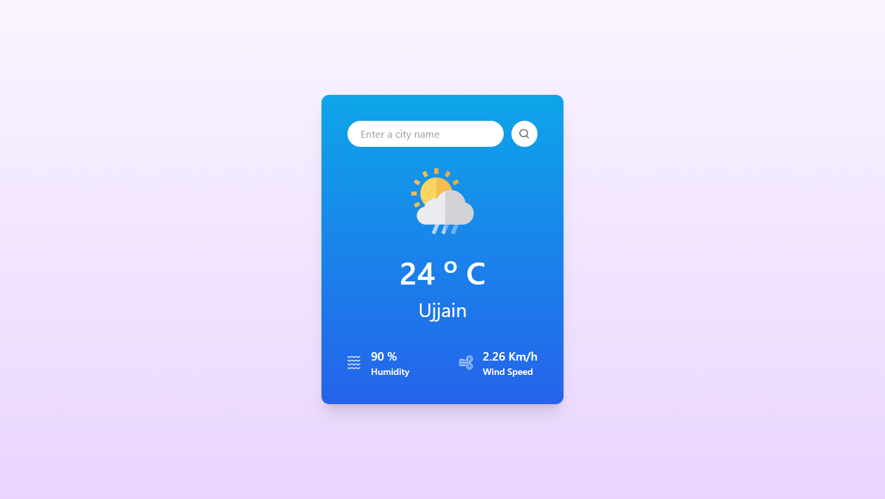
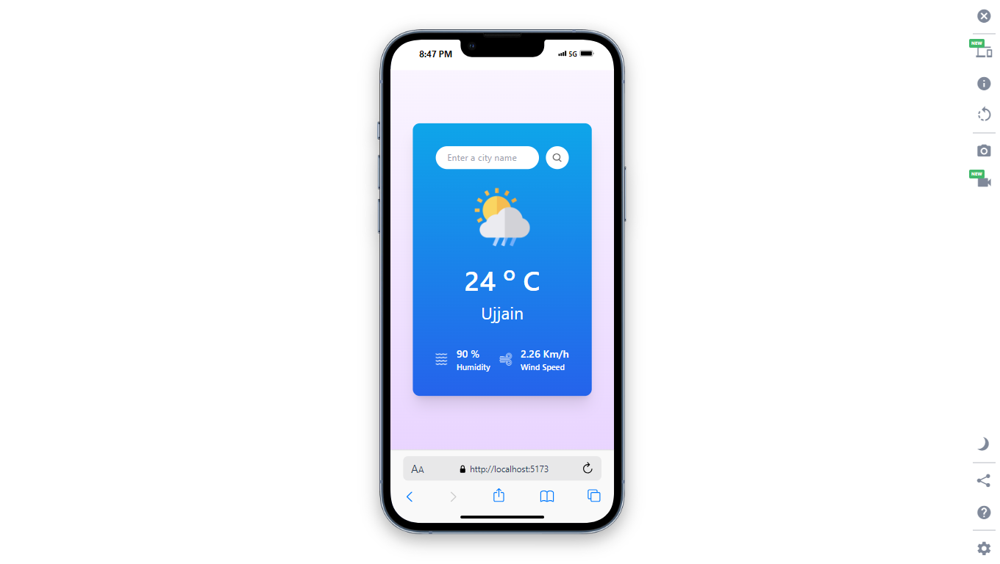

# Weather App

This is a simple weather app built using **React**, **Axios**, and **Tailwind CSS**. The app fetches real-time weather data from the **OpenWeather API** and displays it with a clean and responsive user interface.

## Live Demo

[Weather App](https://weather-app-in-react-chi.vercel.app/)

## Features

- Fetches and displays real-time weather data.
- Beautiful, clean UI designed with **Tailwind CSS**.
- Fully responsive design for all screen sizes.
- Easy-to-use interface to check the weather of any location.

## Technologies Used

- **React**: Frontend framework for building the user interface.
- **Axios**: For making HTTP requests to fetch data from the OpenWeather API.
- **Tailwind CSS**: For styling and ensuring a responsive layout.
- **OpenWeather API**: For retrieving weather information based on user input.

## Project Screenshot

### In Desktop

### In Mobile
